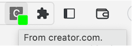
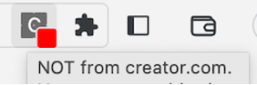
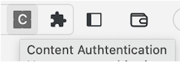

# Digital Media Authentication Proof-Of-Concept

Digital Media Authentication (DMA) is a mechanism whereby media is bound to a cryptographic ownership credential. The ownership credential can be used to determine:
- The identity of the content owner
- Is the content unaltered

This determination can be done by any 3rd party using the ownership credential and the existing digital certificate infrastructure.

This proof-of-concept (POC) implements the essential components of DMA:
- Request by a content owner to register a content item with a registration authority thereby receiving an associated ownership credential.
- Delivery of the content and the credential (aka asset) over HTTP.
- A browser extension that uses the credential to check the content authenticity and provide an indication to the user of: authentic, fake or unknown (no credential).

The POC consists of:
- A DMA web server (server.js).
- Media management tools to register new content.
- An asset file (assets.json) with example assers that a content provider uses.
- A registered media file (registeredContent.json) that a Registration Authority uses.
- A chrome extension (chrome-extension/aaset-authn) demonstrating media authentication of html files in a browser.

## Installing the POC

Install [NodeJS](https://nodejs.org), if necessary.

Install the dma-poc respository.

```
git clone git@github.com:boblund/dma-poc.git
cd dma-poc
npm i
```

Install the chrome extension following ```chrome-extension/README.md```. This can be installed on any chromium based browser.

Start the webserver

```
[PORT=xxxx] node server.js
```

The server will start on ```PORT```, if specified, otherwise it will start on a random, unused port.

## Using The Extension
Go to ```http://localhost:PORT/creator-media.html```. The extension icon should show authentic media.
</br></br>  

Go to ```http://localhost:PORT/fake-media.html```. The extension icon should show fake media (valid ownership credential but wrong media).
</br></br>   

Entering any other URL will show unknown media, i.e. no credential.
</br></br>  

## Content Management

To be provided.

## Acknowledgements

This software and associated documentation is the intellectual property of [Cable Television Laboratories, Inc](www.cablelabs.com).

## License

Creative Commons Attribution-NonCommercial 4.0 International

**THIS SOFTWARE COMES WITHOUT ANY WARRANTY, TO THE EXTENT PERMITTED BY APPLICABLE LAW.**

© CableLabs Inc. 2024
