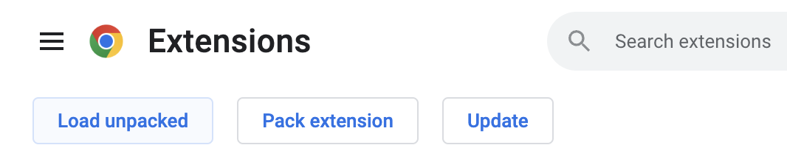

# Install the Digital Media Authentication Extension in Chrome

1. Open the Chrome browser. &nbsp;  
2. Click the 3 vertical dots of the Chrome tool bar then select Extensions => Manage Extensions. &nbsp;   &nbsp;  
3. Click “Load unpacked”. &nbsp;   &nbsp;  
4. Navigate to where you saved the extension (chrome-extension in this example)choose “asset-authn” and then select. &nbsp;   &nbsp;  
5. You should see the loaded extension.  &nbsp;  &nbsp;  
6. Pin the extension to the Chrome toolbar. Click the Extensions button (the puzzle piece) and click the pin next to the “Content Authentication”. &nbsp;   &nbsp;  
7. You should see the extension installed in the toolbar. &nbsp;   &nbsp;    
8. When you load an html page you will see one of the following colored badges on the extension icon for: authentic media, fake media or no credential. The text below the badge appears when you hover over the icon. &nbsp;   &nbsp;  